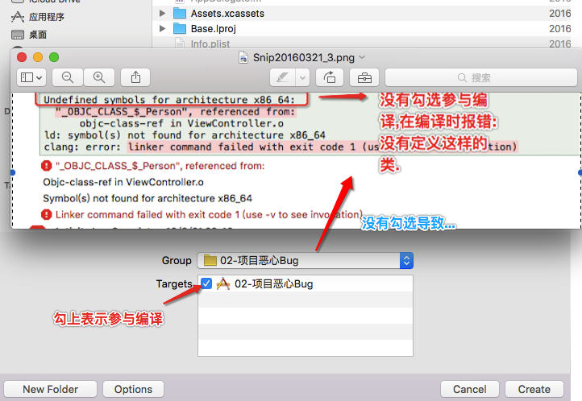
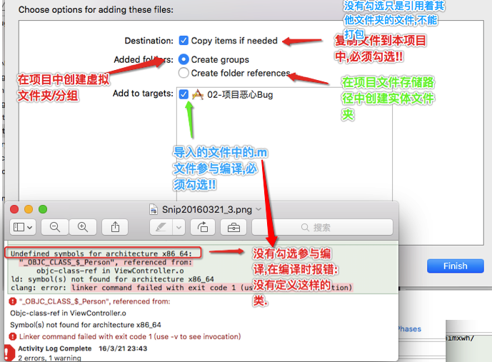
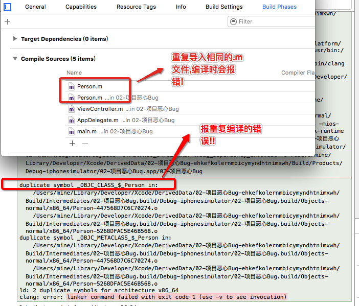

#杂文

###关于`id`和`instancetype`   

```objective-c
// xcode5之前
+ (id)person;
// xcode5
// instancetype:会自动识别当前类对象,会做编译检测.
+ (instancetype)person;

例如:
  // 创建一个子类
- 使用id 编译时不报错,运行时崩溃.
- 使用instancetype 编译时就报错!!!
[[Person person] setFrame:CGRectZero];
```
- Xcode简介

  ```objc
      iOS9:Xcode7
      iOS8:Xcode6
      iOS7:Xcode5
      iOS6:Xcode4 2013 6月份 Xcode4.6
  ```

  ###关于新特性,新关键字研究方法

  - 研究方法
    >研究方法:在新版本的Xcode创建一个空的项目,在老版本的Xcode打开,发现很多错误
    >iOS9出了很多关键字,研究下苹果为什么要新推出关键字.
    >研究新的东西:两点(1.怎么去用(书写格式) 2.关键字有什么作用)
    >关键字作用:仅仅是提示,并不会报编译错误.
    >
    >关键字开发好处:
    >
    >>1.提高代码规范,减少交流时间,把更多精力放在开发中.
    >>
    >>2.迎合swift,swift强语法,必须指定这个属性是否为空.
    >
    >注意:
    >1.关键字只能用来描述对象,不能描述基本数据类型(int等等)
    >2.默认系统如果没有使用关键字,默认(对象属性)就是nonnull
    >3.在NS_ASSUME_NONNULL_BEGIN和NS_ASSUME_NONNULL_END之间,系统对象默认就是nonnull


-  nullable作用:可能为空,表示属性可以传入空,在访问属性和调用方法都会提

   ```objc
     格式(模仿):
     1.方式一:(策略)
     @property (nonatomic, strong, nullable) NSString *name;

     2.方式二:_Nullable(*后面,变量名前面)
     @property (nonatomic, strong) NSString * _Nullable name;

     3.方式三:__nullable(*后面,变量名前面),xcode7beta(测试版本)
     @property (nonatomic, strong) NSString * __nullable name;
   ```

   -  nonnull作用:不能为空

   ```objc
      格式:
       1.使用方式一:(策略)
       @property (nonatomic, strong, nonnull) NSString *name;

       2.使用方式二:_Nullable(*后面,变量名前面)
       @property (nonatomic, strong) NSString * _Nonnull name;

       3.使用方式三:__nullable(*后面,变量名前面),xcode7beta(测试版本)
       @property (nonatomic, strong) NSString * __nonnull name;
   ```

   -  null_resettable作用:声明属性:get 方法不能为空, set 方法可以为空

   ```objc
     1.方式一:(策略)
       @property (nonatomic, strong, null_resettable) NSString *name;
      注意:
      null_resettable:处理为空的情况
      _Null_unspecified作用:不确定状态
   ```

###关于runtime 

- 使用步骤与调用方法
  - 必须导入头文件`#import <objc/message.h>`
  - 进入工程— >Build Setting— >搜索msg— >NO(不严格检查发送消息的调用)
    - 原因:Xcode6开始,苹果不推荐使用runtime,把objc_msgSend(参数)中参数注销!
  - 如果调用一个没有没暴露/系统的方法,使用runtime来实现
    - 格式 : objc_msgSend(Class,Sel,…) ...代表为可变参数

```objective-c
示例代码: 创建p对象
Person *p = objc_msgSend([Person class],@selector(alloc));
p = objc_msgSend(p,@selector(init));
```

- 01.使用runtime交换方法

  - 实例应用:使用UIImage加载图片时,如果没有对应名称的图片提醒没有图片不存在,且**不需要导入相应的UIImage的分类或子类..** 

    - **重点强调**:在分类中**重写系统类的方法**或**交换系统类的方法**;在项目中并不需要导入分类
      - 而在分类中为**系统类扩充自定义的方法/属性**,需要在项目中导入分类才能使用!!!
    - 示例代码如下:

    ```objective-c
    // 本类为UIimage的分类(只有.m文件)
    #import <UIKit/UIKit.h>
    #import "UIImage+Image.h"
    #import <objc/message.h>
    @implementation UIImage (Image)
    // 肯定只调用,类加载进内存的时候调用
    // 程序一启动就会调用
    + (void)load
    {
        // self:UIImage
        // 谁的事情,谁开头 1.发送消息(对象:objc) 2.注册方法(方法编号:sel) 3.交互方法(方法:method) 4.获取方法(类:class)
        // Method:方法名

        // 获取方法,方法保存到类
        // Class:获取哪个类方法
        // SEL:获取哪个方法
        // imageName
       Method imageNamedMethod = class_getClassMethod(self, @selector(imageNamed:));

       // xmg_imageNamed
       Method xmg_imageNamedMethod = class_getClassMethod(self, @selector(xmg_imageNamed:));

        // 交换方法
        method_exchangeImplementations(imageNamedMethod, xmg_imageNamedMethod);
    }

    //+ (UIImage *)imageNamed:(NSString *)name
    //{
    //    
    //}

    // 1.加载图片 2.判断
    + (UIImage *)xmg_imageNamed:(NSString *)name
    {
        UIImage *image = [UIImage xmg_imageNamed:name];

        if (!image) {
            NSLog(@"图片不存在");
        }
        return image;
    }

    @end
    ```


- 02.使用runtime动态添加方法

  - **02.1动态添加无参数类方法**

    ```objc
    // 本类为Person.m文件,Person.h文件中没有声明eat方法
    #import "Person.h"
    #import <objc/message.h>
    @implementation Person
    // 没有返回值,没有参数
    // self:方法调用者
    // _cmd:当前调用方法编号
    // 方法的隐式参数,没有暴露出来参数.
    //v          #         :
    void eat(id self, SEL _cmd)
    {
        NSLog(@"动态添加了一个吃东西方法");
    }

    // 动态去判断下eat方法有没有实现,如果没有实现,动态添加.
    // 作用:处理未实现的对象方法
    // 调用时刻:只要调用了一个不存在的对象方法就会调用(每个类都会有这个方法)
    // sel:就是未实现方法编号
    // *******************************动态添加类方法*****************
    + (BOOL)resolveClassMethod:(SEL)sel
    {
        if (sel == NSSelectorFromString(@"eat")) {
            // eat方法
            // 动态添加这个eat方法
            // Class;给哪个类添加方法
            // SEL:添加方法
            // IMP:方法实现(函数指针),函数名
            // types:方法类型

            // 使用C语言中获取"元类"的函数来获取类
             class_addMethod(objc_getMetaClass("Person"), sel, (IMP)eat, "v#:");

            // 注意:
            // 使用OC的self对象来获取类(需要交换方法来实现)
    //        class_addMethod(self, sel, (IMP)eat, "v#:");
    //        class_addMethod([self class], sel, (IMP)eat, "v#:");

            // 使用OC的字符串来获取类(需要交换方法来实现)
    //         class_addMethod(NSClassFromString(@"Person"), sel, (IMP)eat, "v#:");

            return YES;
        }
        // 由于上面给self(元类)动态添加方法 super调用两种实例/类的resolve方法都可以!!!
        return [super resolveInstanceMethod:sel];
    //    return [super resolveClassMethod:sel];
    }

    //*********************动态添加类方法(使用交换方法)*********
    //+ (void)load {
    //    //获取替换前的类方法
    //     Method class_eat =
    //         class_getClassMethod(self, @selector(resolveClassMethod:));
    //     //获取替换后的类方法
    //     Method class_notEat =
    //         class_getClassMethod(self, @selector(hy2_resolveClassMethod:));
    //
    //     //然后交换类方法
    //     method_exchangeImplementations(class_eat, class_notEat);
    //    
    //    
    //}
    //
    //+ (BOOL)hy2_resolveClassMethod:(SEL)sel{
    //    
    //     if (sel == NSSelectorFromString(@"eat")) {
    //
    //             class_addMethod(objc_getMetaClass("Person"), sel, (IMP)eat, "v#:");
    //        }
    //    
    //     return YES;
    //    
    //}
    @end
    ```


- **02.2动态添加对象方法**

  - 动态添加无参数对象方法

    ```objc
    // 本类为Person.m文件,Person.h文件中没有声明eat方法
    #import "Person.h"
    #import <objc/message.h>
    @implementation Person
    + (BOOL)resolveInstanceMethod:(SEL)sel
    {
        // 动态添加这个eat方法  [NSStringFromSelector(sel) isEqualToString:@"eat"]
        if (sel == NSSelectorFromString(@"eat")) {
            // eat方法
            // 动态添加这个eat方法
            // Class;给哪个类添加方法
            // SEL:添加方法
            // IMP:方法实现,函数名
            // types:方法类型
            class_addMethod(self, sel, (IMP)eat, "v@:");
            return YES;
        }
        // 由于上面给self(本类)动态添加方法 super调用两种实例/类的resolve方法都可以!!!
            return [super resolveInstanceMethod:sel];
    //    return [super resolveClassMethod:sel];
    }

    // 没有返回值,没有参数
    // self:方法调用者
    // _cmd:当前调用方法编号
    // 方法的隐式参数,没有暴露出来参数.
    // v         @        :   
    void eat(id self, SEL _cmd)
    {
        NSLog(@"动态添加了一个吃东西方法");
    }
    @end
    ```

  - 动态添加有1个参数对象方法

    ```objc
    // 本类为Person.m文件,Person.h文件中没有声明- (void)study:(NSString *)book方法
    #import "Student.h"
    #import <objc/message.h>
    @implementation Student
    // v           @        :               @
    void study(id self, SEL _cmd, NSString *book)
    {
        NSLog(@"学习了%@",book);
    }
    + (BOOL)resolveInstanceMethod:(SEL)sel
    {
        if (sel == NSSelectorFromString(@"study:")) {
            // 动态添加study:
            class_addMethod(self, sel, (IMP)study, "v@:@");
            return YES;
        }
        return [super resolveInstanceMethod:sel];
    }

    @end
    ```

    ​


- 03.使用runtime动态添加属性

  - 动态添加属性:  动态让一个属性关联某个对象
    - 设置属性本质,就是添加关联,让这个属性与某个对象产生联系
    - 应用实现:给**系统NSObject添加name属性**(使用时需导入分类)
    - 解决方法及应用场景:给系统类添加属性时候,就使用runtime

    - 重点强调**:在分类中**重写系统类的方法**或**交换系统类的方法**;在项目中并不需要导入分类
      - 而在分类中为**系统类扩充自定义的方法/属性**,需要在项目中导入分类才能使用!!!
    - 实现示例代码如下:

    ```objc
    ----------------------------------NSObject+Property.h---------------------------
    # import <Foundation/Foundation.h>
     // 分类不能生成属性
    @interface NSObject (Property)
       // 分类:只会生成get,set方法声明,并不会生成get,set方法实现和下划线成员属性
       @property NSString *name;
    @end
    ----------------------------------NSObject+Property.m---------------------------
    // 本类为NSObject+Property分类.m文件
    #import "NSObject+Property.h"
    #import <objc/message.h>
    @implementation NSObject (Property)
    // 分类属性name的setter方法
    - (void)setName:(NSString *)name
    {
    // name保存起来
    // 保存属性到系统的类
    // 产生关联,让某个对象(name)与当前对象的属性(name)产生关联
    /**
    * object:给哪个对象添加属性
    * key:属性名
    * value:属性值 , 将外界传来的name用name对象来保存着
    * policy:策略
    */
        objc_setAssociatedObject(self, @"name", name, OBJC_ASSOCIATION_RETAIN_NONATOMIC);
    }

    // 分类属性name的getter方法
    - (NSString *)name
    {
    return objc_getAssociatedObject(self, @"name");
    }

    @end
    ***********************************ViewController.m*****************************
    // ViewController.m文件
    #import "ViewController.h"
    // 导入NSObject+Property分类
    #import "NSObject+Property.h"
    @interface ViewController ()

    @end

    @implementation ViewController
    - (void)viewDidLoad {
     [super viewDidLoad];

     NSObject *objc = [[NSObject alloc] init];
     objc.name = @"123";

     NSLog(@"%@",objc.name);
    }
    @end
    ```


- 04.使用runtime的**运行时策略**使用来实现plist字典中key生成格式化属性(并未使用runtime)

  - 实现思路:创建**自定义方法的NSDictionary的分类** (使用时导入分类)

  - 重点强调**:在分类中**重写系统类的方法**或**交换系统类的方法;在项目中并不需要导入分类

    - 而在分类中为**系统类扩充自定义的方法/属性**,需要在项目中导入分类才能使用!!!

  - 实现代码如下:

    ```objc
    --------------------------------------NSDictionary+PropertyCode.h---------------
    # import <Foundation/Foundation.h>
    @interface NSDictionary (PropertyCode)
    // 设计方法:不要给我闭门造车
    - (void)propertyCode;
    @end
    --------------------------------------NSDictionary+PropertyCode.m---------------
    #import "NSDictionary+PropertyCode.h"
    // isKindOfClass:判断下是否是当前类或者子类
    @implementation NSDictionary (PropertyCode)
    // 自动生成,解析字典去生成,有多少key,就有多少个属性
    - (void)propertyCode
    {
        NSMutableString *codes = [NSMutableString string];
        // 遍历字典中所有key
        [self enumerateKeysAndObjectsUsingBlock:^(id  _Nonnull key, id  _Nonnull value, BOOL * _Nonnull stop) {

            NSString *code;
            // BOOL类型 -->继承自NSNumber私有类型,所以要先判断是否是BOOL类型
            if ([value isKindOfClass:NSClassFromString(@"__NSCFBoolean")]) {

                code  = [NSString stringWithFormat:@"@property (nonatomic, assign) BOOL %@;",key];
           // 字符串类型   
            } else if ([value isKindOfClass:[NSString class]]) {

                code  = [NSString stringWithFormat:@"@property (nonatomic, strong) NSString *%@;",key];
           // 数组类型    
            } else if ([value isKindOfClass:[NSArray class]]) {

                code  = [NSString stringWithFormat:@"@property (nonatomic, strong) NSArray *%@;",key];
           // 字典类型     
            } else if ([value isKindOfClass:[NSDictionary class]]) {

                code  = [NSString stringWithFormat:@"@property (nonatomic, strong) NSDictionary *%@;",key];
           // NSNumber类型     
            } else if ([value isKindOfClass:[NSNumber class]]) {

    // 生成一行属性代码 reposts_count:@property (nonatomic, assign) NSInteger reposts_count;
                code  = [NSString stringWithFormat:@"@property (nonatomic, assign) NSInteger %@;",key];

            }
            // 然后将生成格式化key拼接成一个字符串,进行输出打印
            [codes appendFormat:@"\n%@\n",code];
        }];
        NSLog(@"%@",codes);
    }

    @end
    ```


- 05.使用runtime实现字典转模型

  - **MJExtension框架的实现原理:遍历模型对象的属性,在字典中取出相应key键对应的value值**

    - 实现思路:
      - 创建NSObject分类,在分类中传入字典,对模型对象的成员变量进行截串(去掉模型对象的属性生成带下划线的成员变量中的_下划线)
      - 然后将字典中对应的key通过KVC进行字典转模型赋值
      - 判断字典中key对应的value类型是否为字典,进行二次字典转模型
    - NSObject分类文件实现代码如下:

    ```objc
    ----------------------------------NSObject+Model.h---------------------------
    #import <Foundation/Foundation.h>
    @interface NSObject (Model)
    // 字典转模型
    + (instancetype)objectWithDict:(NSDictionary *)dict;
    @end
    ----------------------------------NSObject+Model.m---------------------------
    #import "NSObject+Model.h"
    #import <objc/message.h>
    @implementation NSObject (Model)
    + (instancetype)objectWithDict:(NSDictionary *)dict
    {
        // 1.创建对应对象
        id objc = [[self alloc] init];

        // 2.字典转模型
        unsigned int count;
        // 2.1 获取所有的成员变量,runtime
        // Ivar *ivarList 是指向数组的指针(保存着数组地址) runtime方法
        Ivar *ivarList = class_copyIvarList(self, &count);
        // 2.2 遍历所有成员变量
        for (int i = 0; i < count; i++) {
            // 2.2.1 从成员变量数组中获取到成员变量
            Ivar ivar = ivarList[i];
            // 获取属性类型
             NSString *ivarType = [NSString stringWithUTF8String:ivar_getTypeEncoding(ivar)];
             //替换ivarType内包含的\" 符号
            ivarType = [ivarType stringByReplacingOccurrencesOfString:@"\"" withString:@""];
             //替换ivarType内包含的@ 符号
            ivarType = [ivarType stringByReplacingOccurrencesOfString:@"@" withString:@""];
            // 2.2.2 获取成员变量名字
            NSString *ivarName = [NSString stringWithUTF8String:ivar_getName(ivar)] 
            // 2.2.3 获取key
            NSString *key = [ivarName substringFromIndex:1];
            // 2.2.4 获取字典中value : user字典 -> user模型
            id value = dict[key];
            // 二级转换  // 01.字典中key对应的value是字典 02.必须是自定义类型
            if ([value isKindOfClass:[NSDictionary class]] && ![ivarType hasPrefix:@"NS"]) {

                // 字典转模型
                // @\"User\" ->  User
                // 获取转换类型
                Class modelClass =  NSClassFromString(ivarType);
                // user字典转换成user模型
                value = [modelClass objectWithDict:value];  
            }

            // 2.2.5 给模型成员属性(KVC)赋值 :User模型
            if (value) {
                [objc setValue:value forKey:key];
            }
        }
        return objc;
    }
    @end
    ```

###关于class,superclass,super,self

- self : 方法的调用者,指针
- super :  编译指示器(标识符),不是指针
  - 本质 : 当前方法调用者(调用对象),只不过让当前方法调用对象去调用父类(任何)方法
  - 更不是父类对象,指向父类方法
- class : 获取方法调用的类对象
- superclass : 获取方法调用者的父类对象

```objc
+ (void)test
{
    // self -> SubPerson
    // class:获取方法调用者的类对象
    // superclass:获取方法调用者的父类对象

    // super:不是一个指针,编译指示器(标识符)
    // super的本质:其实还是当前对象去调用,只不过让当前对象去调用父类方法
    // super不是父类对象,指的是父类方法
    NSLog(@"%@ %@ %@ %@",[self class], [self superclass], [super class], [super superclass]);
    [super test]; // 去父类调用test方法
    // SubPerson Person SubPerson Person √

    // SubPerson Person Person NSObject X
}
```

###关于导入文件/创建文件的注意

- 创建文件注意勾选

  

- 导入文件注意勾选

   

  -  重复导入错误

      

###关于const与#define,static,exten之间结合使用

- 预编译时期:项目一打开的时候,有个自动读条时期


- const与\#define的区别

  - 1.编译时刻: const:编译时期  宏:预编译时期

  - 2.编译检测:const有编译检测,宏没有

    ```objc
    #define XMGUserDefaults [NSUserDefaults standardUserDefaults] 123  // 不报错
    NSString * const name = @"213" 123; // 直接报错!!
    ```

  - 3.宏可以替换方法和函数,const不行

    ```objc
    #define XMGNameKey @"name"
    #define XMGUserDefaults [NSUserDefaults standardUserDefaults]
    ```

  - 4.大量使用宏,不会导致内存暴增,但尽量少使用#define宏,减少打开项目时的预编译时间


- const作用

  - 1.**用来修饰右边变量(基本变量,指针变量(包括OC的对象))**


- 2.**只要被const修饰的变量,只读**
  ```objc
      // 笔试题
      int * const p;         // p:只读  *p:变量
      int const *p1 = &a;   // p1:变量  *p1:只读
      const int *p2;        // p2:变量  *p2:只读
      int const * const p3; // p3:只读  *p3:只读
      const int * const p4; // p4:只读  *p4:只读
  ```


- const使用场景

  - 第一种:替换宏,把一些常见的变量,变成只读变量

    ```objc
    NSString * const key = @"key";
    ```

  - 第二种:方法参数,传入一个地址,不允许在方法内部修改外界值

    ```objc
        int a = 3;
        [self test:&a];
    }
    - (void)test:(int const *)a
    {
        *a = 5; // 报错!!
    }
    ```

- static : 被修饰的变量成为静态变量  用法 : static 类型 变量名

  - static作用

    - 1.**描述局部变量,局部变量被static修饰,生命周期延长(整个app运行过程中都在),作用域不变.**

    - 2.**局部变量被static修饰,只会分配一次内存,程序一启动就会分配**

    - 3.**修饰全局变量,全局变量被static修饰,生命周期不变,作用域会变小,只能在当前文件下使用**

  - static与const结合使用场景: 定义一个常量,只能在本文件中使用

    ```objc
    static NSString * const ageKey = @"age";  // 不能被修改,全局使用
    @implementation ViewController
    - (void)viewDidLoad {
        [super viewDidLoad];
        static NSInteger const ageValue = 10;  // 不能被修改,局部使用
        [[NSUserDefaults standardUserDefaults] setInteger:2 forKey:ageKey];
    @end    
    ```


-  extern作用:**声明一个全局变量,不能定义变量**

   ```objc
    假设:在ViewController.m文件中
    int i = 5;  // 定义全局变量i
    那么:在AppDelegate.m文件中
    exten int i;  // 声明一个全局变量i
    - (BOOL)application:(UIApplication *)application didFinishLaunchingWithOptions:(NSDictionary *)launchOptions {
       // 可以使用在ViewController.m文件中的变量i
       NSLog(@"%d",i); // 5
       return YES;
    }
   ```

   - **不能和static结合使用**

     - **exten与const结合使用**

     - 通常创建一个GolbalConst.h 和 GolbalConst.m 来声明和定义项目文件中需要使用的常量,然后将其导入.pch文件中共项目中所有文件使用

       ```objc
       ----------------------------------GlobeConst.h------------------------------
       // GlobeConst.h文件
       # import <Foundation/Foundation.h>
       // 自定义exten
       # define BAOKIT_EXTERN  extern __attribute__((visibility ("default")))
       extern NSString * const name;           // 声明name全局常量
       BAOKIT_EXTERN NSString * const nameKey; // 声明nameKey全局常量
       ----------------------------------GlobeConst.m------------------------------
         // GlobeConst.m文件
         #import "GlobeConst.h"
         // 开发规范:全局变量不能在自己的文件下定义,搞一个专门文件,去管理所有全局变量
         NSString * const name = @"Spaino";    // 定义name全局常量
         NSString * const nameKey = @"name";   // 定义nameKey全局常量
       ```

       ​

###关于位移枚举

- 位移枚举的集中用法

  - 01.C语言最原始用法:**不指定枚举值类型**

    ```objc
    typedef enum
    {
        XMGDemoTypeTop,  // 第一个值默认为0,往后依次+1
        XMGDemoTypeleft,
    }BAODemoType;
    ```

  - 02.OC中的基本用法: Xcode6之后

    ```objc
    //枚举的类型|类型名称
    typedef NS_ENUM(NSInteger,BAOActionType)
    {
        BAOActionTypeTop, // 第一个值默认为0,往后依次+1
        BAOActionTypeLeft,
    };
    ```

  - 03.OC中主流用法:**位移枚举**

    - 用法解析:例如在监听UIButton的点击事件或UITextFiled的**多个事件**时可以使用 | (按位或)来进行连接,**实现调用一个方法**来监听

    ```objc
    //位移枚举
    // 如果位移枚举的第一个选项不是0,那么暗示可以传0,着效率更高一些
    typedef NS_OPTIONS(NSInteger, BAOType)
    {
        BAOTypeTop = 1<<0,    // 1
        BAOTypeLeft = 1<<1,   // 2
        BAOTypeRight = 1<<2,  // 4
        BAOTypeBottom = 1<<3, // 8
        ...
    };
    ```

    - 针对OC中上述主流用法的示例代码如下:

    ```objc
    -(void)touchesBegan:(NSSet<UITouch *> *)touches withEvent:(UIEvent *)event
    {
        [self demo:BAOTypeTop | BAOTypeLeft | BAOTypeRight |BAOTypeBottom];
        // demo = 1+2+4+8 = 15
    }
    //新的需求:
    // | 如果有1,那么就位1
    // & 只要有0,那么就为0
    -(void)demo:(BAOType)type
    {
        if (type == 0) {
            return;
        }
        NSLog(@"%zd---",type);    // 15

        if (type & BAOTypeTop) {  // 15 & 1 = 1
            NSLog(@"上---%zd",type & BAOTypeTop);
        }
        if(type & BAOTypeLeft)    // 15 & 2 = 1  1111 & 0010 == 0010
        {
            NSLog(@"左---%zd",type & BAOTypeLeft);
        }
        if(type & BAOTypeRight)
        {
            NSLog(@"右---%zd",type & BAOTypeRight);
        }
        if(type & BAOTypeBottom)
        {
            NSLog(@"下---%zd",type & BAOTypeBottom);
        }   
    }
    // 监听UITextField的多个事件
        [_textField addTarget:self action:@selector(textFiledEvent) forControlEvents:UIControlEventEditingDidBegin | UIControlEventEditingDidEnd];
    // UITextField内部对多个枚举值的解析就如同 -(void)demo:(BAOType)type 方法的实现!!
    - (void)textFiledEvent
    {
        NSLog(@"文本框开始编辑或者结束编辑");
    }
    ```

###关于UI控件使用weak与assign的注意

- **weak和assign区别:**
  - **assign:会报坏内存访问**
  - **assign:使用__unsafe_unretained关键字,描述,MRC时代才使用**
  - **__unsafe_unretained:引用计数器不会+1,但是对象被销毁,指针不会清空**
  - **weak:使用__weak关键字,ARC时代出现(Xcode5开始)**
  - **weak:弱指针,不会让引用计数器+1,当对象被销毁,这个弱指针会被清空,nil.**

###关于通知的使用注意

- 01.通知:一对多 监听对象为1,发出对象为多

- 02.通知用法 发出通知 监听通知 (通知中心)

  ```objc
  // 通知中心
  [NSNotificationCenter defaultCenter] 
  ---------------------------------监听通知-------------------------------------
  // 通知监听者/监听通知方法1
  [NSNotificationCenter defaultCenter] addObserverForName:通知名称(NSString) object:通知发出者(nil表示任何对象) queue:队列(执行后面block代码块的线程队列) usingBlock:^(NSNotification * _Nonnull note) {
          // 监听到通知后执行的方法
      }];
  // 通知监听者/监听通知方法2
  [[NSNotificationCenter defaultCenter] addObserver:self(监听通知的对象) selector:@selector(note:)(监听到通知后执行的方法,冒号表示可以在调用方法中获取到参数或发出通知对象)  name:@"xmgNote"(通知名称) object:nil (通知发出者(nil表示任何对象))];
  // 监听到通知调用的方法
  - (void)note:(NSNotification*)note
  {
      note.object; // 获取到发出通知对象
      note.userInfo[@""]; // 获取发出通知时携带的参数
  }
  ---------------------------------发出通知-------------------------------------
  // 发出通知对象
    // 发出通知方法1
    [[NSNotificationCenter defaultCenter] postNotificationName:@"xmgNote"(通知名称NSString) object:nil(通知发出者,nil表示匿名通知)];
    // 发出通知方法2
    [NSNotificationCenter defaultCenter] postNotificationName:(通知名称NSString) object:(通知发出者,nil表示匿名通知) userInfo:发出通知时携带的参数(字典,以键值对的方式存储)];

  ```

- 03.通知一般注意点:

  - 03.1 一定要记得移除通知

    ```
    // 当一个对象即将销毁的时候就会调用
    - (void)dealloc
    {
        // 移除通知
        [[NSNotificationCenter defaultCenter] removeObserver:self.observer];
    }
    ```

    ​

  - 03.2 一定要先监听通知,再发出通知

- 4.通知在多线程中注意点:

  - **监听通知方法调用线程指定为nil(不指定):跟发送通知线程有关系(执行方法在发出通知的线程执行).**

    ```objc
        // queue:决定block在哪个线程执行,nil:表示在发送通知的线程 
        // block:只要有通知发出,就会调用block
        self.observer = [[NSNotificationCenter defaultCenter] addObserverForName:@"xmgNote" object:nil queue:[[NSOperationQueue alloc] init] usingBlock:^(NSNotificati
                                                                                                                                                          on * _Nonnull note) {
            NSLog(@"%@",[NSThread currentThread]); // 子线程,指定在子线程中调用
        }];
    ```

- 05.通知的属性引用策略: 使用weak

  -  **只要是系统管理对象,都不需要自己手动管理,weak**

     ```objc
      @property (nonatomic, weak) id observer;
     ```

###关于block的内存管理

- 关于内存5大区必须知道的前言

  - 内存5个区:堆,栈,方法区,常量区,全局区


- 堆(malloc):手动管理内存
  - 栈(stack):自动管理,代码块一过,就会自动释放.


- 关于MRC必须知道的前言
  - MRC:手动管理内存,需要自己去释放内存
  - MRC开发习惯:访问属性或者设置属性,必须使用点语法,不要使用下划线给属性赋值.(self点语法会调用setter方法,在setter方法内会将原有的下划线属性release,然后将传入的属性赋值在进行retain)
  - 区分MRC代码:

    - 1.看对象能否调用release retain retainCount等方法
    - 2.ARC不能调用[super dealloc]
  - MRC:没有strong,和weak,只有 assign, retain, copy
  - **MRC没有强指针,默认一个对象就是基本类型,存放在"栈"区**


- block在MRC环境下的内存管理:

  - 如果block没有访问外部的全局变量 或者 被static修饰的局部变量,block默认存放在"全局区"
  - 如果block访问外部的局部变量,block存放在"栈"里面
  - MRC:不能使用retain声明block,依然放在栈里面,会自动销毁.
  - MRC:使用copy声明block,才会放在"堆"里面

- **关于ARC必须知道的前言**

  - **ARC管理原则:默认一个局部变量对象,都是强指针,存放"堆区里面**
  - **ARC:如果一个对象没有强指针引用,就会销毁**
  - **ARC:基本数据类型存放在"栈"区,如:int,double,float,enum,struct,**

- **block在ARC环境下的内存管理** 

  - 如果block没有访问外部的全局变量或者局部变量被static修饰,block默认存放在"全局区"(**与MRC一样**)
  - **如果block访问外部的局部变量,block存放在"堆"里面(因为ARC中一个对象默认就是强指针)**
  - **ARC:使用strong声明block,不要使用weak**

- 关于block的循环引用

  - **block会对外部所有强指针对象(已引用着block的强指针)给强引用.**

    - 解决方法:**在block中使用引用block的强指针变成弱指针**

  - block不会对外部弱指针对象给强引用

  - 研究示例代码:

    ```objc
    -------------被其他控制器modal出的ModalViewController控制器------------------
    @interface ModalViewController ()
    // block1 属性
    @property (nonatomic, strong) void(^block1)();
    // 引用子控件vie
    @property (nonatomic, strong)  UIView *vie;
    @end
    @implementation ModalViewController
    - (void)viewDidLoad {
        [super viewDidLoad];
        // block会对外部所有强指针对象(已引用着block的强指针)给强引用.
        // block不会对外部弱指针对象给强引用
        void(^block)() = ^{
            NSLog(@"%@",self);  // block不会强引用self,控制器对象会销毁.
        };
        // 执行block
        block();
    ```

```objc
-----------------------------------
   _block1 = ^{

    NSLog(@"%@",self); // block会强引用self,控制器对象不会销毁!!
    };
    // 执行block1
    _block1();
    
    // 创建子控件vie  
     UIView *vie = [[UIView alloc] initWithFrame:CGRectMake(0,0, 50, 50)];
    [self.view addSubview:vie]; // 将vie添加到控制器view中,控制器的view将其强引用
    _vie = vie;                 // 对请指针修饰的vie属性赋值
//  解决方法:将self变成弱指针
    // 声明weakSelf弱指针
    __weak typeof(self) weakSelf = self; 
     _block1 = ^{
        NSLog(@"%@",weakSelf); // block1不会强引用弱指针weakSelf,控制器对象会销毁!!
        NSLog(@"%@",vie);      // block1中打印强指针vie,由于vie并没有强引用block1
                               // 因此block1不会强引用vie,控制器对象依然会销毁!
    };
    // 执行block1
    _block1();
}
​```
```

- 关于block与变量传递的研究

  - 如果block访问外部局部变量(基本数据类型), 或 没有被任何关键字修饰(如,__block,static),都是值传递(能获取变量的值,不能修改变量的值).
  - block访问被__block,static修饰的外部局部变量 或 全局变量和被satic修饰的全局变量 是指针传递(可以修改变量的值)
  - **__block只能修饰局部变量**

###关于设置控件frme时分别设置size和center来是实现的先后顺序

- **如果size从frame中获取: 先设置尺寸size,再设置center**

- **如果size从bounds中获取: 不需要考虑设置size和center的先后顺序**

  ​

  ​